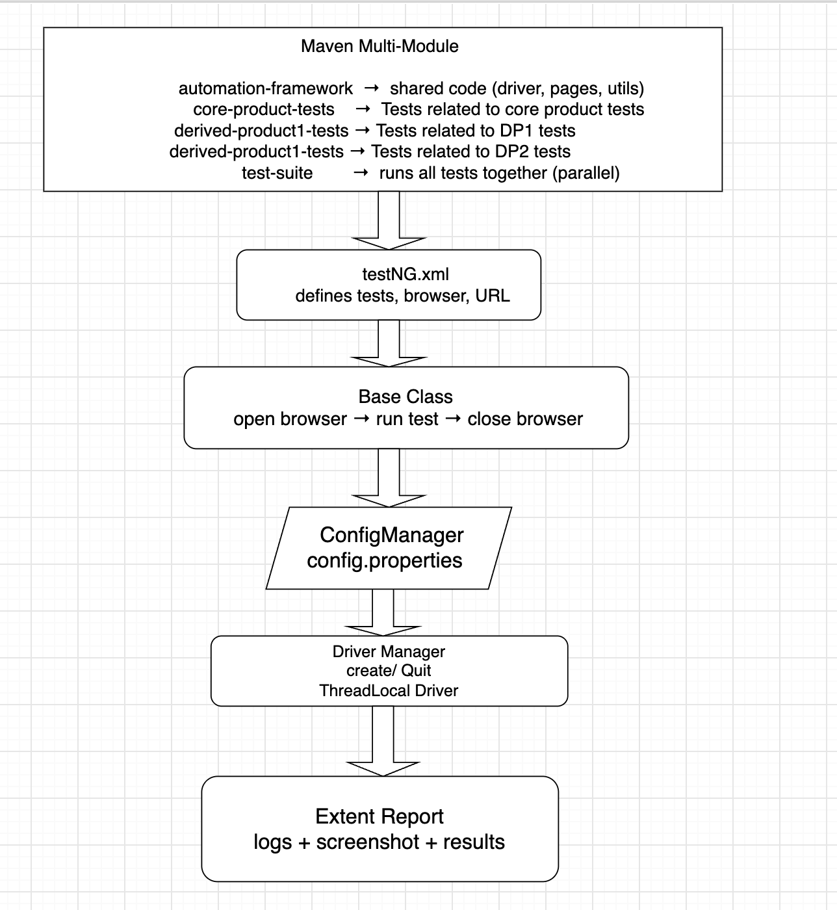

# Veeva Framework - Multi Module Framework

## Overview:
Multi-module Maven project for Selenium WebDriver + TestNG automation across three products. 
Shared framework code lives in automation-framework; each product has its own test module.

## Modules

| Module | Purpose |
|---|---|
| `automation-framework` | Driver, pages, utilities, reporting, config |
| `core-product-tests` | Test Cases related to the Core Product |
| `derived-product1-tests` | Test Cases related to the Derived Product 1 |
| `derived-product2-tests` | Test Cases related to the Derived Product 2 |
| `test-suite` | Aggregated parallel suite (all products) |


## Project Structure

```
Veeva_Assignment_MultiModule/
├── pom.xml                         # Parent POM
├── automation-framework/           # Where All Classes related to Browser Launch, Utitlity Methods, Reporting are present
│   └── src/main/java/.../framework/ 
├── core-product-tests/             # Where all test Cases related to the Core Product  
│   ├── testNg.xml
│   └── src/test/java/.../CP1Test.java
│   └── src/test/java/.../CP2Test.java  
│   └── ......
│  
├── derived-product1-tests/         # Where all test Cases related to the Derived Product 1 
│   ├── testNg.xml
│   └── src/test/java/.../DP1Test.java
│   └── ......
│ 
├── derived-product2-tests/         # Where all test Cases related to the Derived Product 2    
│   ├── testNg.xml
│   └── src/test/java/.../DP2Test.java
│   └── ......
│
└── test-suite/
    └── testNg.xml                  
```


## Prerequisites

- Java 17+
- Maven 3.x
- Chrome and/or Firefox

Run the full parallel suite (all three products in one TestNG run):

```bash
# Step 1: build all modules WITHOUT running their tests
mvn clean install -pl test-suite -am -DskipTests
# Step 2: run ONLY test-suite tests
mvn test -pl test-suite
```

Parallel full suite from IntelliJ: open and run `test-suite/testNg.xml` (after Maven reimport).

## Configuration

- Environment config: `automation-framework/src/main/resources/configuration/config.properties`

## Features

- Multi-module Maven layout (framework + 3 product test modules)
- Page Object Model with centralized `PageFactory.initElements()`
- WebDriverManager for Chrome and Firefox
- YAML test data per product module
- Thread-safe driver and Extent reporting
- Parallel execution via `test-suite/testNg.xml`

## Framework Architecture




    


